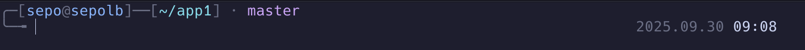
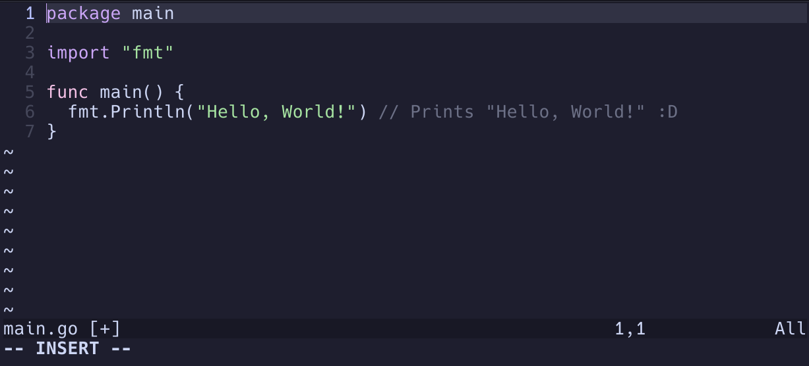

# 🛠️ dotfiles


Minimal, modern, and fully custom configuration files for a Unix-like development environment.
## 📦 Features

- ⚡ **Zsh** – Custom shell config with plugins, aliases, and completions  

- 📝 **Vim** – Tweak-friendly setup with sane defaults, mappings, and colors

## 🚀 Quick Setup

> ⚠️ Back up your existing config files before proceeding.

```bash
curl -L https://github.com/seponik/dotfiles/raw/main/setup.sh | bash
```

Than:
```bash
sudo pacman -S zsh # Arch
sudo apt install zsh # Ubuntu

chsh -s $(which zsh)
```

## 🧪 Tested On

- Arch Linux

- Ubuntu 22.04 LTS

## 🖼️ Preview
Prompt:


Vim:


## 📄 License

MIT © [Sepehr Bostandoust](https://github.com/seponik)